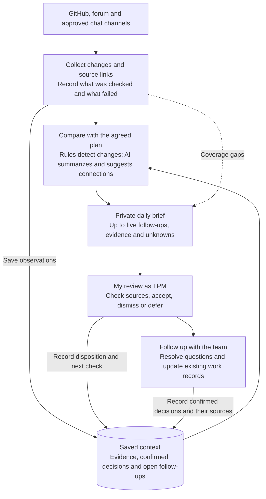

# Part 2: Keeping delivery context current

Joan De Arcayne · 18 September 2026 · Proposed first-month design

Each morning I want to answer: what changed, which commitment could be affected, and what needs a decision or follow-up? The setup would turn activity across repositories and conversations into a short brief for my review, remembering previous decisions so I do not investigate the same question every day.

I would start with one release and NU7, using the team's agreed commitments and the work they depend on. Synapse is a possible starting point to assess for reuse; the design below does not depend on a particular tool.

## The design at a glance

The loop matters: an AI suggestion stays tentative until checked. An accepted suggestion becomes an open follow-up; it does not become a confirmed team decision or completed work.

## What comes in

| Source | Why it matters |
| --- | --- |
| [All Engineering board](https://github.com/orgs/ZcashFoundation/projects/22/views/1) and linked repositories | Work status, PRs, reviews, blockers, checks, and releases. Read linked epics separately because the view hides them. |
| Repositories linked to active dependencies | Changes outside the team that could unblock or delay delivery. Follow relevant links rather than monitor the whole ecosystem. |
| Forum and selected, approved chat channels | Decisions, changing requirements, external requests, and context behind a pause or blocker. |
| Team-confirmed plan | Commitments, owners, checkpoints, dependencies, and agreed completion evidence. Without this baseline, the tool can identify change but cannot reliably call it drift. |

The team explained that GitHub milestones are legacy and epics stay in place on the board without estimates. An epic can close with optional work left unfinished. The tool needs these rules to avoid misleading reminders.

## How the information becomes useful

**Collect changes → connect them to work → compare with confirmed context → draft follow-ups → human review.**

Each day, the tool would read the selected sources and save links, item identifiers, update times, and when it last checked each source. It would remember confirmed decisions, why work is paused, open follow-ups, and when to check again. Saving where collection stopped would let it catch up after a missed run without duplicating items. Work status and commitments would still come from the team's existing records.

This needs a small persistent record store, independent of the AI conversation. Each record links a work item to its evidence, last check, interpretation, confirmed decision, and next follow-up. New evidence can supersede a decision without erasing its history. For example, a confirmed release hold would retain its reason, source, responsible person, and next review date. I would store pointers and concise notes rather than copy entire chat histories.

Rules identify changes in structured states and dates. AI summarizes conversations and suggests connections, with its interpretations kept separate from observed facts and confirmed decisions. Uncertain connections need my review. Merged, released, and activated remain distinct states; one does not establish the others.

| Signal | What the brief should surface |
| --- | --- |
| Waiting review or stalled work | An agreed checkpoint has passed without the expected response or progress. If no checkpoint exists, ask what is expected before treating age as a problem. |
| Dependency change | A prerequisite is resolved while downstream work remains held, or an upstream release is available but adoption is still open. |
| Drift or conflicting evidence | A confirmed commitment is at risk, or the board and linked work disagree. Show the evidence and uncertainty. |
| External request | Show new requests at the next daily check, alongside related work and a suggested contact. Flag unanswered requests after one business day to support the role's expectation of a first response within one to two business days. |

**Example from Part 1:** the September 18 review found [release PR #11254](https://github.com/ZcashFoundation/zebra/pull/11254) still on hold after its original blocker was resolved. The brief would flag it for my review and point me to the Head of Engineering and the relevant maintainers for the remaining technical evidence. If they confirm another hold and a review date, the tool would remember both and wait until that date or a relevant change before reminding me again. Resolving one blocker would not make it mark the release ready.

## What I receive and what stays human

The daily brief would show source coverage and last successful checks, followed by up to five ordinary follow-ups, each with **what changed, why it matters, evidence, uncertainty, proposed action, and confirmed owner or owner unknown**. Other candidates remain available for review. Possible urgent concerns are highlighted separately; the daily brief supplements the existing release and security response channels and cannot replace immediate incident handling.

An [illustrative daily brief](part-2-example-daily-brief.md) shows how this would look using the assessment snapshot, including items deliberately left alone and how a confirmed decision would change the next brief.

I would accept a suggestion, dismiss it with a reason, or set a date to revisit it. The tool would group reports about the same problem and only repeat an item when something changes or a follow-up is due. Marking an alert as read would keep the action open until the agreed work is complete.

Priority, ownership, scope, outreach, escalation, and release decisions stay with the responsible people. The tool lacks the full context and authority to make those calls. It reads and drafts; I verify and follow through using normal team channels.

## How I would catch failures

- **Wrong or stale conclusions:** require source links and timestamps, show conflicting evidence, and recheck status before acting. Treat AI explanations as hypotheses.
- **Missing information:** show collection failures and last successful checks. Recover missed periods and remove duplicates. Missing coverage must never appear as "nothing changed."
- **Noise or missed signals:** compare the brief with manual triage, sample suppressed items, and check known significant team events each week. Track useful follow-ups, false alarms, known misses, and review time.
- **Model or access problems:** fall back to collected facts if summarization fails. Preserve source access restrictions, retain only necessary conversation content, and treat retrieved text as evidence, never instructions.

## First-month scope

**Week 1:** agree sources, commitments, pause rules, and examples to test. **Week 2:** trial repository collection and a private brief alongside manual triage. **Week 3:** add selected forum/chat sources; test pauses, conflicting evidence, and missed-run recovery. **Week 4:** assess usefulness and maintenance effort, then adjust coverage. I would own triage rules and agree responsibility for collection and recovery. WIP dashboards and broader reporting can wait until the daily brief proves useful.

I would continue only if the trial reduces my daily review time, keeps confirmed pauses quiet, and surfaces the important changes found in manual checks. Before expanding coverage, it should correctly handle the Part 1 examples: a resolved blocker with a release still on hold, a deliberately paused issue, and a failed source refresh. These are proposed acceptance checks, not measured results.

*AI use: Codex helped develop and simplify the design using Part 1 findings, the assessment, and the job description. I narrowed the scope and kept decisions human. This proposal has not been built or evaluated.*
